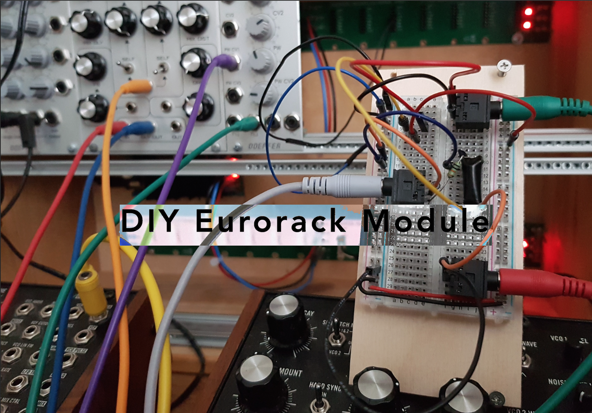
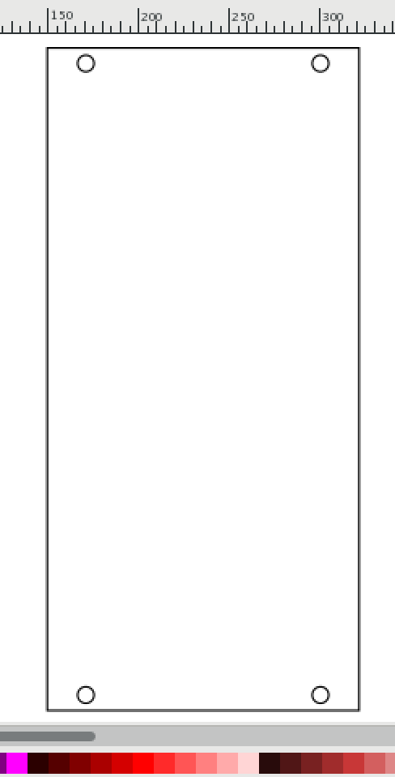
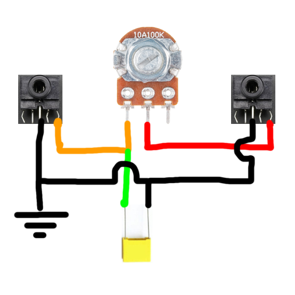
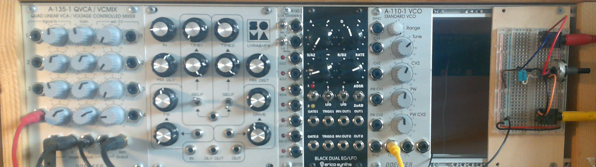

In this repository I have tried to document my approach to DIY eurorack. I want this repository to reflect my creative process and learning of electronic audio circuits and be available as a resource for other people that like myself has no electronical engineering background buts still like to tinker around with electronics and modular synth equipment.

[Getting started](https://github.com/L4COUR/DIY_Eurorack/blob/master/Readme.md#getting-started)

[Making a eurorack prototyping panel](https://github.com/L4COUR/DIY_Eurorack/blob/master/Readme.md#making-a-eurorack-prototyping-panel-optional)

[Drawing power from Eurorack Case](https://github.com/L4COUR/DIY_Eurorack/blob/master/Readme.md#drawing-power-from-eurorack-case)

## Getting started

Before getting started with making DIY eurorack modules I would recommend that you make or buy a eurorack case and power supply, and maybe a mixer and VCO module so you already how a way of producing sound in the eurorack format.

If you have no experience with electronics I would recommend buying an Arduino starter kit and exploring simple circuits with LED's first, since having a basic understanding of common electronics is very important in terms of reading schematics, troubleshooting etc.

Of course you will also need to invest some money in components for each build along with other materials like wood, wires and soldering irons and breadboards.

## Making a eurorack prototyping panel (optional)

In this section we will be looking at how to make a panel with the correct eurorack dimensions. You will need access to a lasercutter or CNC machine, wood, and a program that can draw or handle .svg files

Go to http://www.doepfer.de/a100_man/a100m_e.htm, in order to get the correct dimensions for your panel. In my own process I wanted to make a panel big enough for having a breadboard mounted on the surface, so I went with a module width of 12 HP, which meant an actual module width of 60.60 mm, the standard eurorack height is 3 U or 128.5 mm, this is the same no matter what width you want your module to be.

in terms of thickness doepfer recommends to go with about 2 mm, but just make sure that the machine you use to cut your material can handle the small thickness you settle on, or have available.

when you have either downloaded my .svg file for the 12 HP eurorack panel or made your own .svg file for your dimension eurorack panel, you cut it on your machine of choice. I personally used a CNC Carvey to cut out mine. I couldent figure out how to use it to make the correct dimensions for the screw holes, so I used a drill after the cut and drilled in the 4 holes with an Ø3 drill bit, which matches the Ø3 scrues that are used to mount it to the eurorack case.

## Drawing power from Eurorack Case

Now that the panel is all done it was time to mount the breadboard, and draw power from the eurorack case itself. 

connecting the breadboard to the eurorack's power supply is really quite simple. It is important to note that a standard eurorack power supply has +12 volt, -12 volt and Ground (GND). Depending on what types of circuits you are going to make you need to take the polarity of either +12 or -12 volts into account. As a beginner i wouldnt worry to much about using the -12 volts for now. I connected the +12 volts and GND to the respective bus power lines on my breadboard.

When you want to power a manifactured eurorack module you would usually use a 16 pin connector cable

However since we don't yet have a fully manifactured module but are still in the prototyping face we can use some standard jumber cables that you probably have around somewhere if you bought an Arduino starter kit. and connect just two cables to +12v and GND and then connect them to your breadboard mounted on the eurorack-panel.

Now that you have made a eurorack prototyping panel your are ready to have fun making your first circuits!

## Making a First Order LP-Filter

In this projekt I wanted to make a first order filter for my eurorack. In order to accomplish this I first need to get an understanding of filtering in generel, so building a first order filter will hopefully provide me with this understanding.

A first order filter Schematic is really rather simpel. It mainly consist of two components a resistor and a capacitor. Making a first order filter really gives you a good understanding of how capacitors work.

Since my goal is to make a filter for my eurorack I want to be able to control the cutoff frequency with a potentiometer. this can easily be achieved by switching the resistor in the schematic for a potentiometer.

### Challenges

1) limitation of available components like capacitors and better potentiometers. Because I dont have a stereo 100K Ohm potentiometer I can't make an easy 2nd order RC filter.

2) fungering out the eksakt pinout for the potentiometer and the two stereo 3.5mm jacks and how they should be place in relation to the capacitor in a breadboard configuration.

Despite the limitations of available components I managed through trail and error to find a capacitor and potentiometer where I would here a signifikant change in the timbre of the square wave oscillator I put through it.

Through a kombination of the trail and error proces and [Look Mum No Computers video on simple RC-Filters](https://www.youtube.com/watch?v=Ch9w5JtbZSc) I managed to figure out the correct ways to connect the various components on the breadboard.

### Future developement

- I want to advance my filter from a first order to a second order filter in order to eliminate unwanted frequencies.
- implement cutoff and resonance knobs and CV control.

## Sources

- http://www.doepfer.de/DIY/a100_diy.htm
- https://www.youtube.com/watch?v=3tMGNI--ofU&list=PLHeL0JWdJLvT1PAqW4TtvxtRoXyk741WM
- https://www.youtube.com/watch?v=Ch9w5JtbZSc
